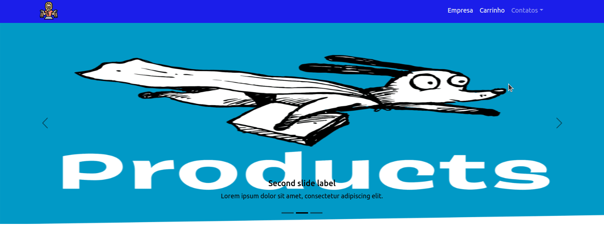

<h1>Projeto de React e TypeScript, criado com Vite - Ainda em desenvolvimento </h1>
<p></img></p>

## Indice
- [Sobre o projeto](#Sobre-o-projeto)
- [Ferramentas](#Ferramentas)
- [Rodando o projeto](#Rodando-o-projeto)

## Sobre o projeto
<p>O projeto foi feito pensando em desenvolver uma pagina web de produtos, utilizando uma api genérica para exibir produtos, aplicando bootstrap 5 no react, um botão para chamada da nova página de produtos e  criar novos cards de produtos, cada qual com 8 produtos, ao clicar em 'mais produtos' (o projeto foi iniciado com o Vite).


## Tecnologias
<ul>
<li>React</li>
<li>TypeScript</li>
<li>Bootstrap</li>
</ul>

## Rodando o projeto

```bash
#Para clonar o projeto:
$git clone https://github.com/FabioDiasRC/react_typescript_produtos
No terminal digitar o comando "npm run dev"